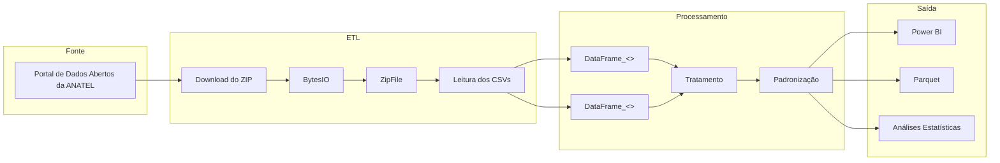

# em desenvolvimento

```mermaid
flowchart LR

    subgraph Fonte
        A["Portal de Dados Abertos da ANATEL"]
    end

    subgraph ETL
        B["Download do ZIP"]
        C["BytesIO"]
        D["ZipFile"]
        E["Leitura dos CSVs"]
    end

    subgraph Processamento
        F["DataFrame_<<param_ano>>"]
        G["DataFrame_<<param_ano>>"]
        H["Tratamento"]
        I["Padronização"]
    end

    subgraph Saída
        J["Power BI"]
        K["Parquet"]
        L["Análises Estatísticas"]
    end

    A --> B
    B --> C
    C --> D
    D --> E
    E --> F
    E --> G
    F --> H
    G --> H
    H --> I
    I --> J
    I --> K
    I --> L
```
