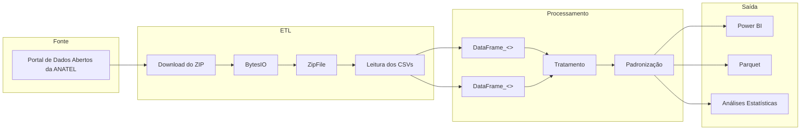

# Em desenvolvimento

# Painel Telefonia Móvel

---

# Fase 1 — Fundação da Plataforma

## Sprint 1.1 ✅

* [x] Estrutura inicial do projeto
* [x] Ambiente virtual
* [x] Git
* [x] Requirements
* [x] .gitignore
* [x] Arquitetura inicial

---

## Sprint 1.2 ✅

Objetivo:

Construir a infraestrutura básica da biblioteca.

Entregas:

* [x] `config.py`
* [x] `log.py`
* [x] `extract.py`
* [x] `transform.py`

---

## Sprint 1.3 

Objetivo:

Construir o modelo relacional (Star Schema).

Entregas:

* [x] df_acessos_movel
* [x] df_reclamacao
* [x] dm_geracao
* [x] dm_tipo_produto
* [x] dm_porte_prestadora
* [x] dm_populacao
* [x] dm_modalidade_cobranca
* [x] dm_calendario

---
