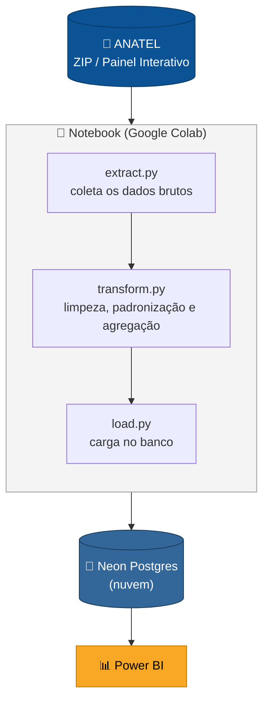
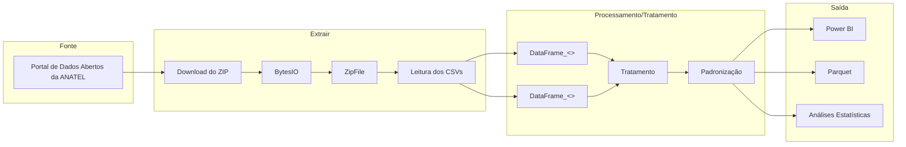

# 📡 ANATEL — Pipeline de Dados de Telecomunicações

Pipeline de coleta, transformação e carga de dados abertos da **ANATEL** (Agência Nacional de Telecomunicações), com destino em um banco **PostgreSQL na nuvem** e visualização em **Power BI**.

---

## 🔄 Arquitetura


```mermaid
flowchart TD
    A[("📡 ANATEL<br/>ZIP / Painel Interativo")] --> B

    subgraph B["🧠 Notebook (Google Colab)"]
        direction TB
        B1["extract.py<br/>coleta os dados brutos"] --> B2["transform.py<br/>limpeza, padronização e agregação"]
        B2 --> B3["load.py<br/>carga no banco"]
    end

    B --> C[("🐘 Neon Postgres<br/>(nuvem)")]
    C --> D["📊 Power BI"]

    style A fill:#0b5394,color:#fff,stroke:#073763
    style C fill:#336699,color:#fff,stroke:#1c3d5a
    style D fill:#f9a825,color:#000,stroke:#c17900
    style B fill:#f4f4f4,stroke:#999
```


---

## 📊 Fontes de dados

| Fonte | Tipo de coleta | Tabela no Neon |
|---|---|---|
| Acessos de Banda Larga Fixa | Download de ZIP (dados abertos) | `acessos_banda_larga_fixa` |
| Reclamações de consumidores (SCM) | Download de ZIP (dados abertos) | `reclamacoes_banda_larga_fixa` |
| Acessos de Telefonia Móvel | Download de ZIP (dados abertos), leitura em chunks | `acessos_telefonia_movel` |
| Evolução histórica por Meio de Acesso (desde 2011) | Automação de navegador (Playwright) sobre o painel interativo da ANATEL | `evolucao_meio_acesso_historico` |
| População estimada por UF/Região (IBGE) | API do SIDRA + API de Localidades (IBGE) | `dm_populacao` |

> A fonte de Evolução por Meio de Acesso é um caso especial: esse dado histórico só está disponível dentro de um gráfico do painel público da ANATEL, sem exportação direta via arquivo. A coleta automatiza o clique no botão "Exportar Dados" do próprio painel. Veja os detalhes em [`docs/AUTOMACAO_NAVEGADOR_DOCUMENTACAO.md`](./docs/AUTOMACAO_NAVEGADOR_DOCUMENTACAO.md).
>
> A fonte de Telefonia Móvel tem o maior volume do projeto (10+ milhões de linhas por semestre) e exigiu leitura em chunks, agregação incremental e um checkpoint de qualidade de dados. Veja [`docs/TELEFONIA_MOVEL_DOCUMENTACAO.md`](./docs/TELEFONIA_MOVEL_DOCUMENTACAO.md).
>
> ⚠️ **Status atual (jul/2026):** a coleta de Telefonia Móvel para 2026 está pausada — a ANATEL não preencheu os campos `UF`/`Código Nacional` para parte dos registros de jan-mar/2026. Aguardando correção da fonte.

---

## 📁 Estrutura do projeto

```
anatel/
│
├── notebooks/
│   └── etl_anatel_neon.ipynb      # notebook principal de ETL (roda no Google Colab)
│
├── src/
│   ├── __init__.py
│   ├── config.py                   # conexão com o Neon (via variáveis de ambiente)
│   ├── extract.py                  # coleta dos dados brutos (ZIP e automação de navegador)
│   ├── transform.py                # limpeza, padronização e agregação
│   └── load.py                     # carga dos dataframes no Neon
│
├── scripts/
│   └── ...                         # scripts avulsos de teste/depuração local
│
├── docs/
│   ├── README.md                    # índice da documentação técnica
│   ├── DOCUMENTACAO.md              # visão geral e histórico de decisões do projeto
│   ├── EXTRACT_DOCUMENTACAO.md      # detalhamento do módulo extract.py
│   ├── TRANSFORM_DOCUMENTACAO.md    # detalhamento do módulo transform.py
│   └── AUTOMACAO_NAVEGADOR_DOCUMENTACAO.md  # automação via Playwright, passo a passo
│
├── sql/                              # scripts de criação de tabelas (opcional)
├── dashboard/
│   └── README.md                    # descrição/prints do dashboard Power BI
│
├── .env.example                      # modelo de variáveis de ambiente (sem valores reais)
├── .gitignore
├── requirements.txt
└── README.md                         # este arquivo
```

---


```mermaid
flowchart LR

    subgraph Fonte
        A["Portal de Dados Abertos da ANATEL"]
    end

    subgraph Extrair
        B["Download do ZIP"]
        C["BytesIO"]
        D["ZipFile"]
        E["Leitura dos CSVs"]
    end

    subgraph Processamento/Tratamento
        F["DataFrame_<<param_ano>>"]
        G["DataFrame_<<param_ano>>"]
        H["Tratamento"]
        I["Padronização"]
    end

    subgraph Saída
        J["Power BI"]
        K["Parquet"]
        L["Análises Estatísticas"]
    end

    A --> B
    B --> C
    C --> D
    D --> E
    E --> F
    E --> G
    F --> H
    G --> H
    H --> I
    I --> J
    I --> K
    I --> L
```


```mermaid
architecture-beta
    group sources(cloud)[Sources]
        service src_a(server)[SCM] in sources
        service src_b(server)[Reclamacoes] in sources
        service src_c(server)[SMP] in sources

    group storage(database)[Storage]
        service db_one(database)[Aiven] in storage
        service db_two(database)[Neon] in storage
        service db_three(database)[Aiven] in storage

    group output(disk)[Output]
        service brief(disk)[Brief] in output
        service analyst(server)[Analyst] in output
        service delivery(cloud)[Delivery] in output

    src_a:B --> T:db_one
    src_b:B --> T:db_two
    src_c:B --> T:db_three
    db_two:B --> T:brief
    brief:R --> L:analyst
    analyst:R --> L:delivery

    align row src_a src_b src_c
    align row db_one db_two db_three
    align row brief analyst delivery

    align column src_a db_one
    align column src_b db_two brief
    align column src_c db_three
```

# Painel Telefonia Móvel

---

# Fase 1 — Fundação da Plataforma

## Sprint 1.1 ✅

* [x] Estrutura inicial do projeto
* [x] Ambiente virtual
* [x] Git
* [x] Requirements
* [x] .gitignore
* [x] Arquitetura inicial

---

## Sprint 1.2 ✅

Objetivo:

Construir a infraestrutura básica da biblioteca.

Entregas:

* [x] `config.py`
* [x] `log.py`
* [x] `extract.py`
* [x] `transform.py`

---

## Sprint 1.3 ✅

Objetivo:

Construir o modelo relacional (Star Schema).

Entregas:

* [x] df_acessos_movel
* [x] df_reclamacao
* [x] dm_geracao
* [x] dm_tipo_produto
* [x] dm_porte_prestadora
* [x] dm_populacao
* [x] dm_modalidade_cobranca
* [x] dm_calendario
* [ ] df_reclamacao_smp

## Sprint 1.4 ✅

Objetivo:

Construir esboço da estrutura do painel

Entregas:

* [x] Cards
* [x] gráficos
* [x] layout
* [x] icones


---
## Sprint 1.5 ✅

Objetivo:

Construir medidas DAX

Entregas:

* [x] Totais
* [x] Anterior
* [x] Variação
* [x] Market share
* [x] Crescimento
* [x] Média
* [x] Calendario


---

## Sprint 1.6

Objetivo:

Wireframe Figma

Entregas:

* [x] Cabeçalho
* [x] Cards
* [X] Icones
* [x] Panorama 
* [x] Pos
* [X] Pre
* [X] Dados
* [ ] Reclamacoes
* [ ] 

---

## Sprint 1.7 ✅   

Objetivo:

Construir Gráficos

Entregas:

* [x] Cards
* [x] Donut
* [x] Quadro
* [x] Historico
* [x] Mapa
* [x] Crescimento
* [x] Market Share
* [x] Tabela

---

## Sprint 1.8    

Objetivo:

Dependencias dos filtros nos gráficos

Entregas:

---

## Sprint 1.9   

Objetivo:

---
